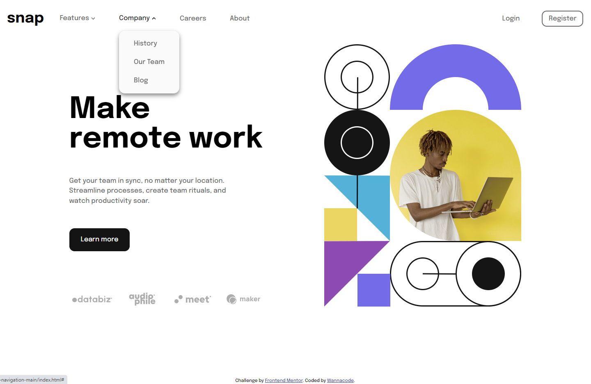
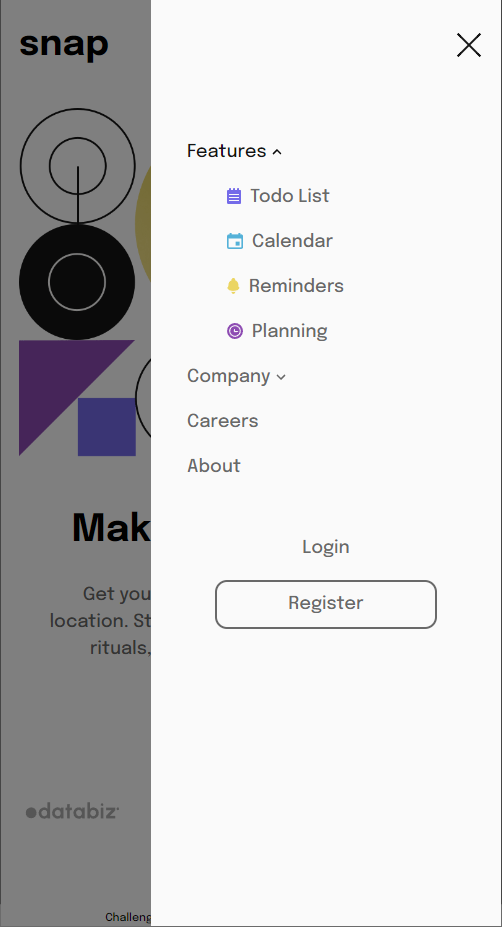

# Frontend Mentor - Intro section with dropdown navigation solution

This is a solution to the [Intro section with dropdown navigation challenge on Frontend Mentor](https://www.frontendmentor.io/challenges/intro-section-with-dropdown-navigation-ryaPetHE5). Frontend Mentor challenges help you improve your coding skills by building realistic projects. 

## Table of contents

- [Overview](#overview)
  - [The challenge](#the-challenge)
  - [Screenshot](#screenshot)
  - [Links](#links)
- [My process](#my-process)
  - [Built with](#built-with)
  - [What I learned](#what-i-learned)
  - [Continued development](#continued-development)
  - [Useful resources](#useful-resources)
- [Author](#author)
- [Acknowledgments](#acknowledgments)

## Overview

This challenge was built upon the previous one I did, which was the News Homepage.

### The challenge

Users should be able to:

- View the relevant dropdown menus on desktop and mobile when interacting with the navigation links
- View the optimal layout for the content depending on their device's screen size
- See hover states for all interactive elements on the page

### Screenshots






### Links

- Solution URL: [Solution URL here](https://github.com/kwngptrl/FEM-intro-section-with-dropdown-navigation-main)
- Live Site URL: [Add live site URL here](https://your-live-site-url.com)

## My process

Since this challenge is similar to the previous one I did, which was the News Homepage, a lot of the underlying code was moved into here as well. The only thing different was the two dropdown menus, but even that is derived from the main one. The lines of JS in this challenge increased. Still it took me a long time to finish and it's not yet as I want it to be. 

### Built with

- Semantic HTML5 markup
- CSS custom properties
- Flexbox
- CSS Grid
- Mobile-first workflow
- Accessibility

### What I learned

In this challenge, I used a new pattern for the grid container which I derived from Ahmad Shadeed's article, [Aligning Content In Different Wrappers](https://ishadeed.com/article/aligning-content-different-wrappers/). This seems to solve the issue I had in the News Homepage challenge wherein the header/navbar was not behaving as I hoped.

In mobile mode, I also fixed the issue where in some x-sized viewport, a vertical scrollbar appears and clicking on the hamburger icon shifts it a bit. The fix involves adding an additional utility class with JS detecting if ```window.innerWidth > document.body.clientWidth```. Also, a little transition to delay the appearance of the 'X' icon until the full deployment of the mobile menu was added in.

As for the dropdown menus in the navbar, I read lots of articles on the proper implementation. I still don't know which is the best. The one I used is derived from [Fly-out Menus | Web Accessibility Initiative (WAI) | W3C](https://www.w3.org/WAI/tutorials/menus/flyout/). But in the example, there's only one dropdown. I had to figure out how to do two of them and I wanted to close one when I clicked on the other. I ended up using two nested forEach statements as shown below:

```
dropdown.forEach((item, index, arr) => {
    item.addEventListener('click', (e) => {
        if (item.nextElementSibling.className == "dropdown-menu hidden") {
            item.nextElementSibling.classList.remove('hidden');
            item.setAttribute('aria-expanded', "true");
            /* the next code block closes the current dropdown-menu if another dropdown-menu is clicked on */
            /* Works with however many dropdown-menus a navigation bar has */
            arr.forEach((el, i) => {
                if (i !== index) {
                    el.nextElementSibling.classList.add('hidden');
                    el.setAttribute('aria-expanded', "false");
                }
            });
```

As noted in the comments in the code block above, it works even with several dropdown menus in the navbar. As for the nested forEach, I later turned it into a function called ```resetDropdowns()``` to close any open dropdowns in certain situations, i.e. adjusting the viewport, clicking outside the main navbar. I think I could also replace that nested forEach with a call to the external function, but I'll have to use arguments.

This challenge also sees more use of ```min(), max(),``` & ```clamp``` for width, font-size, line-height, and gap values. This makes for a smoother transition when the viewport changes. The ```:where``` selector is also used to shorten the code a bit.

I also played around with right-to-left styling techniques, although I don't know where I'm going with it. Still, start the practice early.


### Continued development

I have found some ways to animate the chevron and the dropdown menu. However, I only implemented it on the chevron.

### Useful resources

As listed above. If I remember anything further, I will add it here.

- [Example resource 1](https://www.example.com) - This helped me for XYZ reason. I really liked this pattern and will use it going forward.
- [Example resource 2](https://www.example.com) - This is an amazing article which helped me finally understand XYZ. I'd recommend it to anyone still learning this concept.

**Note: Delete this note and replace the list above with resources that helped you during the challenge. These could come in handy for anyone viewing your solution or for yourself when you look back on this project in the future.**

## Author

- Frontend Mentor - [@Wannacode](https://www.frontendmentor.io/profile/kwngptrl)

## Acknowledgments

All credits as mentioned above.